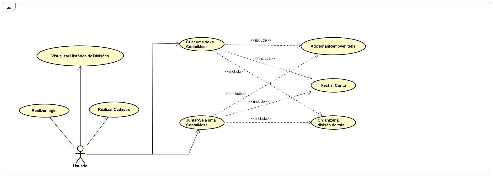

# Especificações do Projeto

Pré-requisitos: <a href="1-Documentação de Contexto.md"> Documentação de Contexto</a>

Definição do problema e ideia de solução a partir da perspectiva do usuário. É composta pela definição do  diagrama de personas, histórias de usuários, requisitos funcionais e não funcionais além das restrições do projeto.

Apresente uma visão geral do que será abordado nesta parte do documento, enumerando as técnicas e/ou ferramentas utilizadas para realizar a especificações do projeto

## Personas

Luís Santos, de 28 anos, é um analista de marketing. Como entusiasta de happy hour, ele adora sair com os amigos para bares locais depois do trabalho. Luís deseja poder escanear o código QR da conta do bar para agilizar o processo de divisão da conta entre seus amigos. Além disso, ele valoriza ver as promoções e ofertas especiais do bar para economizar dinheiro e aproveitar ao máximo o momento. Luís também acha importante poder adicionar itens à conta do grupo para garantir que todos os pedidos sejam considerados na divisão final.

Isabela Ferreira, com 25 anos, é uma estudante de gastronomia. Como amante da culinária, ela gosta de experimentar diferentes bares locais com os amigos. Isabela deseja poder tirar fotos dos pratos no aplicativo para registrar os itens pedidos e facilitar a divisão precisa da conta. Além disso, ela valoriza receber sugestões de bares locais baseadas em avaliações gastronômicas, ajudando-a a descobrir novos lugares para experimentar com seus amigos. Isabela também quer a opção de dividir igualmente ou de acordo com o que cada um consumiu para atender às diferentes preferências de compartilhamento do grupo.

Rafael Oliveira, de 32 anos, é um empreendedor. Como alguém que gosta de socializar, ele adora organizar encontros com amigos em bares locais para ampliar sua rede de contatos. Rafael deseja criar um evento no aplicativo e convidar seus amigos para coordenar esses encontros de maneira mais eficiente. Além disso, ele valoriza a capacidade de verificar o histórico de encontros anteriores para lembrar onde foram e como foram divididos os gastos em cada evento. Rafael também acha importante poder incluir uma nota ou comentário junto à divisão da conta para manter a transparência com seus amigos.

## Histórias de Usuários

Com base na análise das personas forma identificadas as seguintes histórias de usuários:

|EU COMO... `PERSONA`| QUERO/PRECISO ... `FUNCIONALIDADE` |PARA ... `MOTIVO/VALOR`                 |
|--------------------|------------------------------------|----------------------------------------|
|Luís Santos         | quero escanear o QR Code da conta, se possível [RF07]  | para garantir que o valor no aplicativo e os itens consumidos foram os mesmos |
|Luís Santos         | quero poder escanear o cardápio caso o estabelecimento possua um [RF08]| para facilitar a marcação dos itens consumidos |
|Luís Santos         | quero poder adicionar itens à conta do grupo [RF03] e [RF09]| para garantir que todos os pedidos sejam considerados na divisão final |    
|Isabela Ferreira    | quero poder adicionar gorjeta/couvert [RF03] e [RF09]| para entrar na divisão da conta  |
|Isabela Ferreira    | quero ter a opção de receber notificações [RF10]|para me lembrar de anotar o que estou consumindo|
|Isabela Ferreira    | quero ter a opção de dividir igualmente, ou de acordo com o que cada um consumiu [RF06] e [RF05]| para atender às diferentes preferências de compartilhamento do grupo.|
|Rafael Oliveira     | quero ao final do pedido poder avaliar o estabelecimento [RF11]| para futuramente me ajudar a escolher um estabelecimento baseado nas minhas experiências.|
|Rafael Oliveira     | quero ter a capacidade de verificar o histórico de encontros anteriores [RF11], [RF12] e [RF13]| para lembrar onde fomos e como foram divididos os gastos em cada evento.|
|Rafael Oliveira     | quero poder incluir uma nota ou comentário junto à divisão da conta [RF13]| para lembrar o motivo de gastos específicos e manter a transparência com meus amigos.|
|Rafael Oliveira     | quero poder saber antecipadamente o valor da minha conta a cada item consumido [RF03] e [RF04]| para controlar quanto posso gastar.|

## Modelagem do Processo de Negócio 

### Análise da Situação Atual

Atualmente, dividir a conta entre amigos durante encontros em bares ou restaurantes pode ser uma tarefa complicada e propensa a erros, o que pode levar a mal-entendidos e conflitos entre os participantes. Os principais problemas identificados na situação atual são os seguintes:

* Complexidade das Despesas: Em encontros sociais, os participantes geralmente fazem pedidos individuais com diferentes itens e preços. Calcular manualmente a parte de cada pessoa pode ser complicado e demorado, especialmente quando há variações nas taxas de serviço e impostos.

* Dificuldade de Rastreamento: Manter o controle dos itens pedidos por cada indivíduo e registrar os preços correspondentes pode ser desafiador, especialmente quando o grupo é grande e os pedidos são frequentes.

* Falhas na Comunicação: As preferências de pagamento e os limites financeiros nem sempre são claros entre os amigos, o que pode levar a desacordos sobre como a conta deve ser dividida.

* Risco de Conflitos: A divisão desigual ou injusta das despesas pode gerar descontentamento entre os participantes, resultando em conflitos e afetando negativamente a experiência social.

###Modelo do Sistema Atual:

No cenário atual, a divisão da conta em um bar é geralmente realizada de forma manual, com os seguintes passos:

* Coleta de Pedidos: Cada pessoa faz o seu pedido e o garçom anota as escolhas de cada indivíduo.

* Registro de Preços: Os preços dos itens são registrados manualmente, considerando taxas e impostos, se aplicáveis.

* Cálculo Manual: Alguém do grupo assume a responsabilidade de calcular as partes individuais com base nos pedidos e preços registrados. Isso pode ser suscetível a erros humanos.

* Divisão de Pagamento: Os participantes contribuem com dinheiro para cobrir suas partes, sem garantia de que o cálculo tenha sido feito de maneira precisa e justa.

* Possíveis Discrepâncias: Se ocorrerem discrepâncias ou desentendimentos sobre a divisão, pode haver discussões ou até mesmo conflitos.

Proposta de Aplicativo Móvel:

Para abordar esses desafios, um aplicativo móvel dedicado à divisão de contas em bares pode ser uma solução inovadora. O aplicativo poderia oferecer as seguintes funcionalidades:

* Registro de Pedidos: Os participantes poderiam fazer seus pedidos individualmente no aplicativo, que registraria automaticamente os itens e preços.

* Cálculo Automático: Com base nos pedidos registrados, o aplicativo poderia calcular automaticamente as partes individuais, considerando taxas e impostos.

* Transparência: Os participantes poderiam visualizar claramente como o cálculo foi feito, promovendo transparência e evitando mal-entendidos.

* Histórico de Encontros: O aplicativo poderia manter um histórico de encontros anteriores e divisões de contas, facilitando referências futuras.

* Compartilhamento Fácil: Os participantes poderiam compartilhar facilmente os detalhes da divisão com seus amigos, evitando discussões posteriores. 

### Descrição Geral da Proposta

A proposta consiste no desenvolvimento e implementação de um aplicativo móvel inovador projetado para simplificar e otimizar a divisão de contas entre amigos durante encontros em bares e restaurantes. O aplicativo visa oferecer uma solução conveniente e precisa para calcular as partes individuais de cada participante, promovendo a transparência, evitando conflitos e melhorando a experiência social.

Limites da Proposta:
Este aplicativo se concentra exclusivamente na divisão de contas em encontros sociais em estabelecimentos de alimentação e bebidas. Ele não aborda outras funcionalidades relacionadas a planejamento de eventos, compartilhamento de despesas residenciais ou cálculos financeiros complexos. Além disso, o aplicativo não substitui o atendimento e a interação com os funcionários do local, mas sim complementa o processo de divisão de contas.

Ligações com Estratégias e Objetivos do Negócio:
A proposta está alinhada com as estratégias de proporcionar uma experiência positiva aos clientes e de aprimorar a eficiência dos processos. Ao resolver um desafio comum nas interações sociais em estabelecimentos comerciais, o aplicativo contribui para a satisfação dos clientes e para a promoção de relações harmoniosas entre amigos. Além disso, a implementação do aplicativo demonstra o compromisso do negócio com a inovação tecnológica e a busca por soluções práticas.

Oportunidades de Melhorias:

* Integração de Pagamentos: Além de calcular as partes individuais, o aplicativo pode ser aprimorado com a capacidade de realizar pagamentos diretos por meio de carteiras digitais ou serviços de pagamento online, simplificando ainda mais o processo.

* Recomendações Personalizadas: Com base em padrões anteriores de pedidos e preferências, o aplicativo poderia oferecer recomendações de pratos ou bebidas para os participantes, enriquecendo a experiência gastronômica.

* Integração com Redes Sociais: A possibilidade de compartilhar detalhes da divisão de contas através de redes sociais ou mensageiros populares pode facilitar a comunicação entre os amigos.

* Avaliações e Comentários: Os usuários poderiam avaliar e comentar sobre a experiência de usar o aplicativo, fornecendo feedback valioso para melhorias contínuas.

* Integração com Estabelecimentos: A colaboração com estabelecimentos para oferecer promoções ou descontos exclusivos aos usuários do aplicativo poderia ser uma vantagem adicional.

* Soluções para Grupos Grandes: Desenvolver funcionalidades específicas para lidar com grupos maiores, como ferramentas de votação para escolher restaurantes ou pedidos em grupo, poderia atender a uma variedade de cenários.

Em resumo, a proposta de desenvolver um aplicativo móvel para a divisão de contas em bares visa proporcionar uma solução eficaz para um desafio comum, alinhando-se às estratégias de melhorar a experiência do cliente e a eficiência dos processos. Há diversas oportunidades para aprimorar ainda mais o aplicativo e agregar valor aos usuários, contribuindo para o sucesso e a diferenciação do negócio no mercado.

### Processo 1 - Cálculo Automático das Partes Individuais

Nome do Processo: Cálculo Automático das Partes Individuais

Oportunidades de Melhorias:

* Personalização de Taxas e Gorjetas: Permitir que os usuários personalizem as taxas de serviço e gorjetas de acordo com suas preferências ou as políticas do estabelecimento.

* Divisão de Itens Compartilhados: Incluir a capacidade de dividir equitativamente os custos de itens compartilhados, como aperitivos ou uma garrafa de vinho.

* Revisão e Ajustes: Oferecer uma etapa de revisão onde os usuários possam verificar e ajustar manualmente as partes individuais antes de confirmar o cálculo.

* Arredondamento Inteligente: Implementar um sistema de arredondamento inteligente para evitar valores fracionados inconvenientes.

* Divisão Proporcional: Criar a opção de dividir os itens de acordo com a proporção de consumo de cada pessoa, levando em consideração os preços dos pedidos. 

Descrição do modelo BPMN:

* Registrar Pedidos: Os participantes fazem seus pedidos individualmente através do aplicativo, que registra automaticamente os itens selecionados e seus preços.

* Calcular Partes: Com base nos pedidos registrados e nas configurações de taxas, o aplicativo calcula automaticamente as partes individuais de cada participante.

* Revisar e Ajustar: Os usuários têm a opção de revisar as partes calculadas e fazer ajustes manualmente, se necessário, para garantir precisão e personalização.

* Finalizar Divisão: Após revisões ou ajustes, os usuários confirmam a divisão, e o aplicativo fornece os valores finais a serem pagos por cada pessoa.

## Indicadores de Desempenho

| Indicador               | Objetivos                                          | Descrição                                                                                                                             | Cálculo                                                       | Fonte de Dados                            | Perspectiva                |
|-------------------------|---------------------------------------------------|--------------------------------------------------------------------------------------------------------------------------------------|--------------------------------------------------------------|-----------------------------------------|----------------------------|
| Precisão do Cálculo      | Alcançar alta precisão nas partes individuais.    | Mede a exatidão das partes calculadas em relação ao valor real da conta.                                                            | (Partes Calculadas / Valor Real da Conta) * 100           | Dados internos do aplicativo             | Qualidade do Processo       |
| Tempo de Processamento   | Apresentar as partes em um tempo eficiente.       | Avalia o tempo necessário para calcular e apresentar as partes individuais após o registro dos pedidos.                         | Tempo médio para apresentar as partes individuais         | Dados internos do aplicativo             | Eficiência do Processo      |
| Taxa de Aceitação de Ajustes Manuais | Minimizar ajustes manuais frequentes.   | Mede quantos usuários fazem ajustes manuais após o cálculo automático das partes.                              | (Usuários com ajustes manuais / Total de Usuários) * 100 | Dados internos do aplicativo             | Eficiência e Satisfação    |
| Satisfação do Usuário    | Garantir a satisfação dos usuários.              | Avalia a satisfação dos usuários em relação à facilidade de uso e à eficácia do processo de divisão de contas.                      | Média das avaliações de satisfação dos usuários           | Pesquisas de satisfação dos usuários     | Satisfação do Usuário      |
| Taxa de Utilização do Aplicativo | Promover o uso contínuo do aplicativo. | Mede a frequência com que os usuários optam por usar o aplicativo para calcular partes em comparação com outros métodos. | (Usos do aplicativo / Total de encontros sociais) * 100 | Dados internos do aplicativo             | Utilização do Aplicativo    |

## Requisitos

As tabelas que se seguem apresentam os requisitos funcionais e não funcionais que detalham o escopo do projeto. Para determinar a prioridade de requisitos, aplicar uma técnica de priorização de requisitos e detalhar como a técnica foi aplicada.

### Requisitos Funcionais

|ID    | Descrição do Requisito  | Prioridade |
|------|-----------------------------------------|----|
|RF-001| O aplicativo deve possibilitar o cadastro de usuários.| ALTA | 
|RF-002| O aplicativo deve permitir o login na conta cadastrada mediante usuário e senha.| ALTA |
|RF-003| O aplicativo deve permitir a cada usuário anotar os itens que consumiu.| ALTA |
|RF-004| O aplicativo deve permitir que os usuários tenham a capacidade de monitorar em tempo real o valor de sua conta individual a cada item consumido.| ALTA |
|RF-005| O aplicativo deve informar aos usuários o total gasto pela mesa assim que ele encerrar a conta.| ALTA |
|RF-006| O aplicativo deve ser capaz de realizar a divisão da conta de duas formas: igualmente entre todos os membros do grupo ou individualmente. | ALTA |
|RF-007| O aplicativo deve permitir que os usuários possam escanear o QR Code da conta para conferência.| BAIXA |
|RF-008| O aplicativo deve permitir que os usuários possam escanear o cardápio do estabelecimento para que o usuário marque os itens que foram consumidos de maneira rápida e precisa.| BAIXA |
|RF-009| O aplicativo deve permitir que os usuários possam adicionar uma quantia para gorjeta ou couvert à conta. Essa quantia será incluída na divisão final da conta.| ALTA |
|RF-010| O aplicativo deve permitir envio de notificações para lembrar os usuários de anotar os itens que estão consumindo durante o encontro, assegurando que todos os itens consumidos sejam devidamente incluídos na conta final. | MÉDIA |
|RF-011| O aplicativo deve permitir que os usuários avaliem o estabelecimento onde o encontro ocorreu após o encerramento da conta para, futuramente, ajudar o usuário a escolher locais para futuros encontros.| BAIXA |
|RF-012| O aplicativo deve permitir que os usuários acessem um histórico de encontros anteriores, fornecendo uma visão geral dos locais visitados e como os custos foram divididos em cada evento, permitindo aos usuários um melhor controle financeiro e uma revisão dos itens consumidos nos locais frequentados.| MÉDIA |
|RF-013| O aplicativo deve permitir que os usuários incluam uma nota ou comentário junto à divisão da conta. Isso permitirá aos usuários anotar detalhes específicos sobre o encontro ou os itens consumidos, ajudando a lembrar o motivo de gastos específicos e mantendo a transparência com os demais integrantes do grupo.| BAIXA |
|RF-014| O aplicativo deve permitir que os usuários criem uma mesa, incluir usuários nela e encerrar a conta.| ALTA |

### Requisitos não Funcionais

|ID     | Descrição do Requisito  |Prioridade |
|-------|-------------------------|----|
|RNF-001| O Aplicativo deverá ter uma interface intuitiva e de fácil utilização. | ALTA | 
|RNF-002| As informações apresentadas devem ser claras, legíveis e organizadas de forma a facilitar a compreensão. |  ALTA | 
|RNF-003| Durante a escolha de itens e cálculos de divisão, não deve haver atrasos perceptíveis. | MÉDIO |
|RNF-004| Os dados das contas e históricos de encontro devem ser armazenados de forma segura e acessível para os usuários. | ALTO |
|RNF-005| A aplicação deve ser projetada para atender às diretrizes de acessibilidade, tornando-a utilizável para pessoas com deficiências visuais ou outras limitações. | BAIXO |
|RNF-006| O aplicativo pode ser integrado a serviços de avaliação gastronômica, para fornecer recomendações e avaliações de restaurantes. | BAIXO |
|RNF-007| O aplicativo deve fornecer sugestões de bares e restaurantes com base na localização do usuário, ele deve ser capaz de rastrear a localização do usuário com precisão e respeitar as preferências de privacidade. | BAIXO |
|RNF-008| O aplicativo deve garantir consistência nos cálculos de divisão de contas, independentemente do número de pessoas no grupo ou dos itens pedidos. | ALTO |

## Restrições

O projeto está restrito pelos itens apresentados na tabela a seguir.

|ID| Restrição                                             |
|--|-------------------------------------------------------|
|01| O projeto deverá ser entregue no final do semestre letivo, não podendo extrapolar a data de 20/11/2023. |
|02| A equipe não pode subcontratar o desenvolvimento do trabalho. |
|03| O projeto não poderá ser entregue sem que as funcionalidades essenciais estejam prontas. |
|04| O projeto deve ser desenvolvido utilizando a linguagem de programação React Native. |

## Diagrama de Casos de Uso

# Matriz de Rastreabilidade

# Gerenciamento de Projeto

De acordo com o PMBoK v6 as dez áreas que constituem os pilares para gerenciar projetos, e que caracterizam a multidisciplinaridade envolvida, são: Integração, Escopo, Cronograma (Tempo), Custos, Qualidade, Recursos, Comunicações, Riscos, Aquisições, Partes Interessadas. Para desenvolver projetos um profissional deve se preocupar em gerenciar todas essas dez áreas. Elas se complementam e se relacionam, de tal forma que não se deve apenas examinar uma área de forma estanque. É preciso considerar, por exemplo, que as áreas de Escopo, Cronograma e Custos estão muito relacionadas. Assim, se eu amplio o escopo de um projeto eu posso afetar seu cronograma e seus custos.

## Gerenciamento de Tempo

Com diagramas bem organizados que permitem gerenciar o tempo nos projetos, o gerente de projetos agenda e coordena tarefas dentro de um projeto para estimar o tempo necessário de conclusão.

O gráfico de Gantt ou diagrama de Gantt também é uma ferramenta visual utilizada para controlar e gerenciar o cronograma de atividades de um projeto. Com ele, é possível listar tudo que precisa ser feito para colocar o projeto em prática, dividir em atividades e estimar o tempo necessário para executá-las.

!

## Gerenciamento de Equipe

O gerenciamento adequado de tarefas contribuirá para que o projeto alcance altos níveis de produtividade. Por isso, é fundamental que ocorra a gestão de tarefas e de pessoas, de modo que os times envolvidos no projeto possam ser facilmente gerenciados. 

## Gestão de Orçamento
| Categoria          | Descrição                                           | Custo Estimado  |
|-------------------|----------------------------------------------------|-----------------------------|
| Recursos Humanos  | Desenvolvedores (2)                                 | R$30.000,00                     |
|                   | Designer de Interface                               | R$8.000,00                      |
|                   | Gerente de Projeto                                  | R$5.000,00                      |
| Hardware          | Computadores para a equipe de desenvolvimento      | R$10.000,00                     |
|                   | Dispositivos móveis para testes                     | R$3.000,00                      |
| Rede              | Serviços de hospedagem e servidores                 | R$2.000,00                      |
| Software          | Licenças de software de desenvolvimento            | R$2.500,00                      |
|                   | Ferramentas de design e prototipagem                | R$1.000,00                      |
| Serviços          | Testes de usabilidade e QA                          | R$4.000,00                      |
|                   | Serviços de consultoria técnica                     | R$3.500,00                      |
| **Total**         |                                                    | **R$69.000,00**                 |

